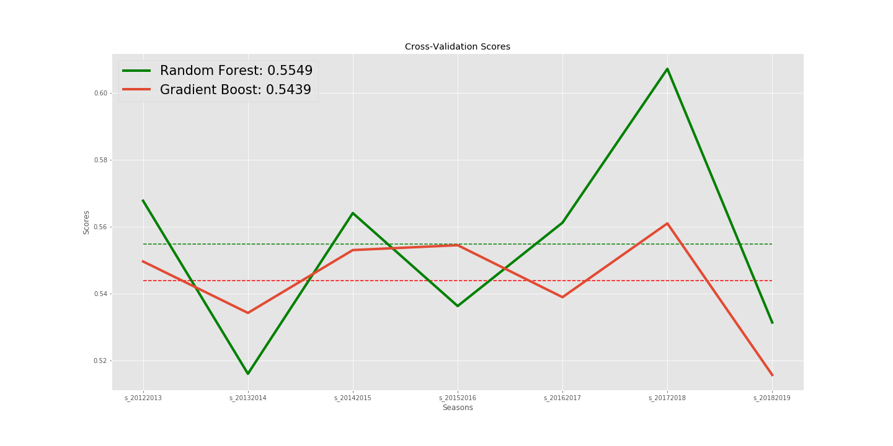

**Predicting NHL Game Outcomes - The Data**
* 7 seasons from 2011 – 2018
* 11,434 games
* Broken down by team and game statistics
* Average of 5.55 goals per game
* Average spread 2.05 goals
* Which statistics or features best predict game outcomes?

**So What?**
* Sports gambling is a 150 billion dollar industry. (ref 1)
* Profits can be made above around 61.5% accuracy prediction.
* Other Models (ref 2):
* Top test accuracy: 60.3% with “Logistic 3”
* Average accuracy: 59.3%
* Mentions of models performing around 62

* Images from corsicahockey.com

**Models - All Seasons**
* Trained Logistic Regression, Random Forest, and Gradient Boost models on all seasons in the data set.

* Gradient Boost had highest average cross-val score, Random Forest had highest overall score for one season.

**Models – One Season**
* Trained Random Forest and Gradient Boost on 1 season (2016-2017).
* Feature importances:

* No features really jump out.
* Next, trained the models on one season and predicted other seasons.

* Now Random Forest performed best overall and on average but accuracy didn't improve a whole lot for either.

**Conclusions**
* Don’t bet money based on this model.
* Hockey is difficult to predict.
* Add in player stats to as features.

**Lessons Learned and Further Research**
* EDA took longer than expected - almost 3 full days.
* Only used Grid Search to optimize Random Forest and Gradient Boost models.  Try Random Search and also XGBoost in the future.
* Use a neural network.  Issues with deep learning took longer than expected.
* Optimize a pipeline for cleaning the data.
* This project needs significant re-work.
* Clean up notebooks, utilize src, more time on modeling to achieve 60%.

**References**
<ul>1. "How Much Money Do Americans Bet On Sports?", Legal Sports Betting, Nov 8, 2020,  https://www.legalsportsbetting.com/how-much-money-do-americans-bet-on-sports. 
    2. "Corsica Predictions Explained", Corsica Hockey, 2020, https://www.corsicahockey.com/corsica-predictions-explained.
<\ul>
